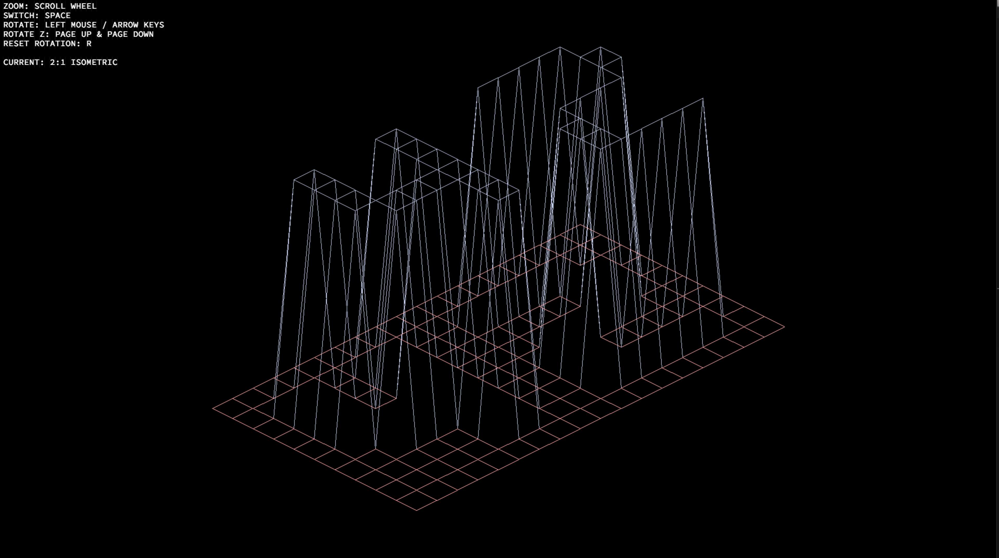

# FDF
FDF is a project from [Codam](https://www.codam.nl). This project is about creating a simplified graphic “wireframe” (“fils de fer” in french, hence the name of the project) representation of a relief landscape linking various points (x, y, z) via segments. The coordinates of this landscape are stored in a file passed as a parameter to the program. It also allows you to learn and use the graphic library miniLibX.

## Compiling
Run ```make```, an executables called ```fdf``` should compile directly.

## Challenge
#### For fdf:
The goal is to create three types of graphic, wireframe projections from the coordinates of a landscape stored in a file passed as a parameter to the program. Each number inside the file corresponds to a point in space:
    - The horizontal position corresponds to its axis.
    - The vertical position corresponds to its ordinate.
    - The value corrseponds to its altitude.

## Bonus
Change type of projection inside the window.
Create a standard color alteration changed with the height of a coordinate.
Allow the user to add a color themselves to the coordinate inside the map.
Control/move the wireframe 3-Dimensionally.
Auto Zoom.
Reset the Rotation


## Usage
After creating the executable file, ```fdf```, it can be executed by giving it a file with coordinates as parameter e.g.:

```$>cat 42.fdf```
```0  0  0  0  0  0  0  0  0  0  0  0  0  0  0  0  0  0  0
0  0  0  0  0  0  0  0  0  0  0  0  0  0  0  0  0  0  0
0  0 10 10  0  0 10 10  0  0  0 10 10 10 10 10  0  0  0
0  0 10 10  0  0 10 10  0  0  0  0  0  0  0 10 10  0  0
0  0 10 10  0  0 10 10  0  0  0  0  0  0  0 10 10  0  0
0  0 10 10 10 10 10 10  0  0  0  0 10 10 10 10  0  0  0
0  0  0 10 10 10 10 10  0  0  0 10 10  0  0  0  0  0  0
0  0  0  0  0  0 10 10  0  0  0 10 10  0  0  0  0  0  0
0  0  0  0  0  0 10 10  0  0  0 10 10 10 10 10 10  0  0
0  0  0  0  0  0  0  0  0  0  0  0  0  0  0  0  0  0  0
0  0  0  0  0  0  0  0  0  0  0  0  0  0  0  0  0  0  0
$>
```

```./fdf ./42.fdf```

In this case, the output looks like shown below. 

</img>


## Challenge
Allowed functions for the mandatory part are
- ```open```, ```read```, ```write```, ```close```
- ```malloc```, ```free```
- ```perror```, ```strerror```
- ```exit```
- All the functions defined in the ```math``` library (-lm and man 3 math)
- All the functions defined in the ```miniLibX``` library

